# Links importantes del Bootcamp
https://coda.io/d/Links-importantes-del-Bootcamp-net_dicwLWknfcW/Links-importantes-del-Bootcamp-net_suKk0#_luDFE

# CLASE 1: La increible y técnica historia de un backend .net y su API desalmada

<b>Profe: Lucho Robles</b>

Se aprenderá a hacer una API Restful

## Syllabus

https://coda.io/d/Syllabus-for-the-net-Bootcamp-students_ds0YOStS3Lu/Syllabus-for-the-net-Bootcamp-students_sujo8#_luiKD

## History
Creador de C# Anders Hejlberg @ahejlsberg

.NET se compone de 4 lenguajes actualmente, entre ellos C# (más usado), F# y VisualBasic .net

## dotnet build

**.csproj:** todo el contenido del proyecto está ahí, versiones, librerías

Por encima de este, está **.sln** el cual es un conjunto de proyectos que hacen algo

Cuando .net compila algo va al .csproj busca las librerías, las organiza, compila y dice si hay algún error, dónde y cuál es.

## dotnet run

Ya sabe qué es lo que tiene que hacer, lo levanta, lo pone en algún sitio y se puede usar

## Swagger

Descripción gráfica del API que se va a hacer, ayuda a probar y ver que todo esté funcionando. Es solo una conexión directa con la API. Dice donde están los endpoints

## Postman

Llamados a la API, sirve para probar, es diseñado para trabajar con APIs

## Git

Enviar el proyecto a github

## .NET 

Framework, conjunto de librerías que tiene como base un lenguaje

## Creación del proyecto

Con el comando:

        dotnet new webapi -o Discoteque

* **webapi:** tipo de proyecto
* **-o**: (output) es el nombre del proyecto 

Luego entrar a la carpeta donde está el proyecto /Discoteque, escribir el comando:

        dotnet build

Toma el csproj, compila los archivos de .net y de c#, dependiendo de eso muestra si hay errores o no. 

Luego del build, realizar el comando para correr el proyecto:

        dotnet run

Al abrir el localhost en el puerto donde corrió y agregando la ruta a weatheforecast, aparece lo siguiente:

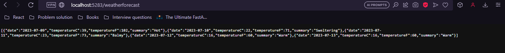

Cuando se hace eso, levanta la aplicación a partir el csproj

Se puede ver el swagger con cambiando la url:

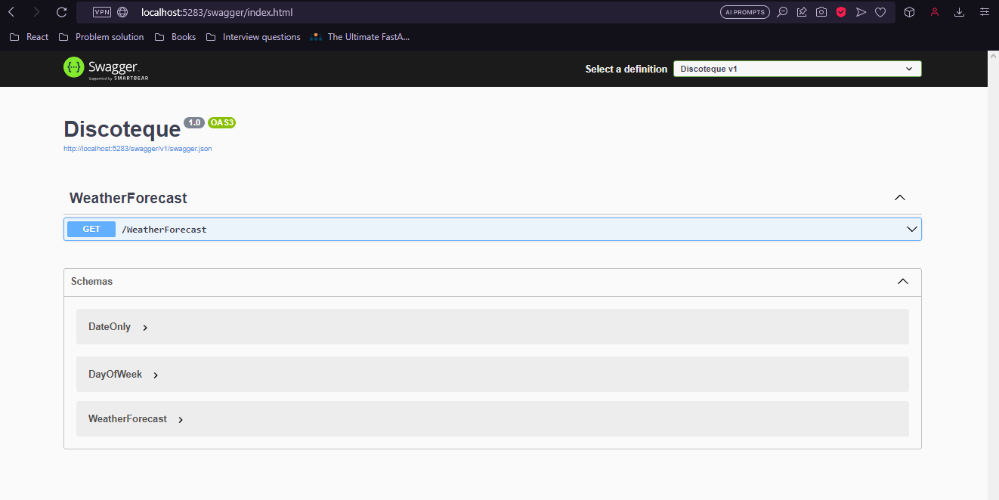

Respuesta del GET:

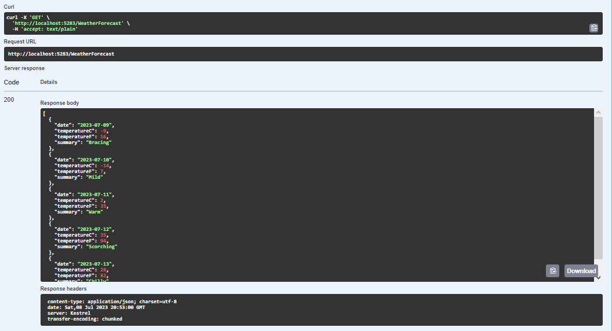

Lo que esta haciendo es tomar valores random de temperatura y los convierte:
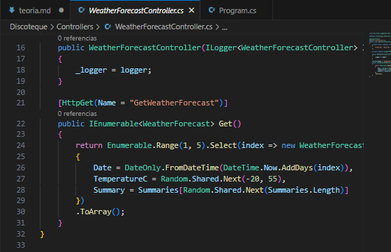

## Descripción del proyecto

1. Una API tiene un punto de entrada que es el Program.cs

2. El controlador usa un **using** para acceder a librerías externas, allí se usa mvc. Luego se tienen los atributos de la clase en []

    Blazor: Framework de frontend para web en .net, es muy rápido. El padre es aspnet mvc

3. WeatherForecast.cs es una entidad

## ORM

Modela una BD de SQL en código para tenerlo como una clase

## Formato de fecha correcto: 

        YYYY-MM-DD

## Kestrel

Servidor web de .net

## DLL (Dynamic League Library)

Extensión de librerías en windows

## Project in the correct configuration: REFACTORIZACIÓN

Método mediante el cual se toma el código para hacer el código más bonito. Se divivió el proyecto en capas:

- API
- Business
- Data: Donde está toda la parte de BD

## Ciclo de operación de la app
Se hace un request, se llama al Business para hacer lógica, cuando se sepa que hacer, se va a la BD mira qué necesita lo trae y en la API se muestra. Así cada parte se ocipa de una sola cosa pequeña.
```shell
# bash terminal
Lucho@<DiscoRootFolder>: dotnet new sln -n Discoteque
Lucho@<DiscoRootFolder>: dotnet new classlib -o Discoteque.Business
Lucho@<DiscoRootFolder>: dotnet new webapi -o Discoteque.API
Lucho@<DiscoRootFolder>: dotnet new classlib -o Discoteque.Data
Lucho@<DiscoRootFolder>: dotnet sln add Discoteque.API/
Lucho@<DiscoRootFolder>: dotnet sln add Discoteque.Business/
Lucho@<DiscoRootFolder>: dotnet sln add Discoteque.Data/
Lucho@<DiscoRootFolder>: dotnet build
```

After that is done,  you should receive something like this:

        # begins output
        MSBuild version 17.6.3+07e294721 for .NET
          Determining projects to restore...
          All projects are up-to-date for restore.
          Discoteque.Business -> /Users/dracvs/Projects/Pioneras/Discoteque/    Discoteque.Business/bin/Debug/net7.0/Discoteque.Business.dll
          Discoteque.Data -> /Users/dracvs/Projects/Pioneras/Discoteque/        Discoteque.Data/bin/Debug/net7.0/Discoteque.Data.dll
          Discoteque.API -> /Users/dracvs/Projects/Pioneras/Discoteque/ Discoteque.API/bin/Debug/net7.0/Discoteque.API.dll

        Build succeeded.
            0 Warning(s)
            0 Error(s)

        Time Elapsed 00:00:02.17

And then we are going to add package:

``` shell
# bash terminal
Lucho@<DiscoRootFolder>:  cd Discoteque.API/
Lucho@<DiscoRootFolder/Discoteque.API>:  dotnet add package Microsoft.EntityFrameworkCore.InMemory 
Lucho@<DiscoRootFolder>: cd Discoteque.Data/
Lucho@<DiscoRootFolder/Discoteque.Data>: dotnet add package Microsoft.EntityFrameworkCore.InMemory
```

Go back and cd .. into the root folder

And THEN we are doing this:

``` shell
# bash terminal
Lucho@<DiscoRootFolder>: cd Discoteque.API
Lucho@<DiscoRootFolder/Discoteque.API>: dotnet add package Microsoft.VisualStudio.Web.CodeGeneration.Design -v 7.0.7
Lucho@<DiscoRootFolder/Discoteque.API>: dotnet add package Microsoft.EntityFrameworkCore.Design -v 7.0.7
Lucho@<DiscoRootFolder/Discoteque.API>: dotnet add package Microsoft.EntityFrameworkCore.SqlServer -v 7.0.7
Lucho@<DiscoRootFolder/Discoteque.API>: dotnet tool uninstall -g dotnet-aspnet-codegenerator
Lucho@<DiscoRootFolder/Discoteque.API>: dotnet tool install -g  dotnet-aspnet-codegenerator
Lucho@<DiscoRootFolder/Discoteque.API>: dotnet tool list -g
Lucho@<DiscoRootFolder/Discoteque.API>: dotnet tool update -g dotnet-ef
Lucho@<DiscoRootFolder/Discoteque.API>: dotnet add package  Microsoft.EntityFrameworkCore.Tools --version  7.0.7
```

## Para generar el gitignore

Usar el comando:

        dotnet new gitignore


## Troubleshooting cuando los archivos bin y obj si se suben al repositorio cuando no deberían

1. En una terminal en la carpeta raíz ejecutar los comandos:

        git rm -r --cached .

2. Con `git status` se puede ver que se tomaron todos esos archivos que no se necesitan trackear

3. Hacer el commit

        git add .
        git commit .m "Update gitignore"
        git push

<hr><hr>

# CLASE 2 - 15.07.2023:

Dentro de la carpeta Discoteque.API debería haber lo siguiente:

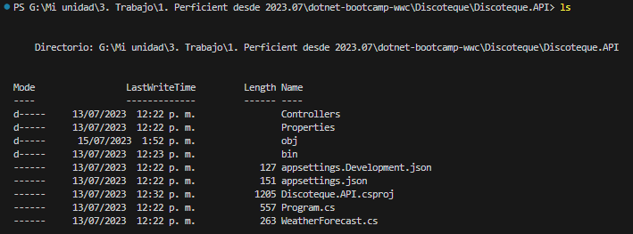

Librerías que se van a usar:

- InMemory (en API y Data)

## Discoteque.API - Run and Debug

1. Tener abierto el archivo Discoteque.API.cs en API

2. Dar click en run and debug y en la lista seleccionar la primera opción

Esto genera dos archivos en la carpeta .vscode: launch.json y tasks.json

### New method

1. Ingresar al archivo WeatherForecastController.cs y agregar la función siguiente al final del archivo:

``` csharp
[HttpGet]
public async Task<IActionResult> WomenWhoCode() {
    var name = "My name is Laura";
    name += " and I like Salsa";

    return Ok(name);
}
```

2. Dejar el archivo abierto e ir a la parte del depurador, dar click en la flecha de correr después de poner un punto de depuración en la línea de var name

Stacktrace: Lista de qué hace el sistema, dónde y por qué, se usa para depurar.

3. Ir al postman y poner el link `https://localhost:7155/WeatherForecast`, con el puerto que aparece y poniendo ese nombre del controlador y al ejecutarlo  ya se empieza la depuración

## Discoteque.Data

1. Se crea la carpeta Models y dentro de ella el archivo BaseEntity.cs con el siguiente código:

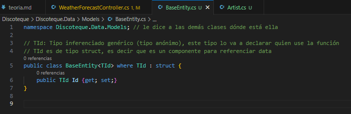

> Modelo: donde vamos a reflejar el mundo en la BD, se hará con Entity Frameworl que es unn ORM: manejador de BD, toma el código y hace todo lo que se haría con SQL.

2. Se crea el otro modelo llamado Artist, como se crea en la misma carpeta debe tener el mismo namespace y está heredando de la clase BaseEntity, tomando el atributo anónimo definido allí y definiendo un tipo de dato

De esta forma:

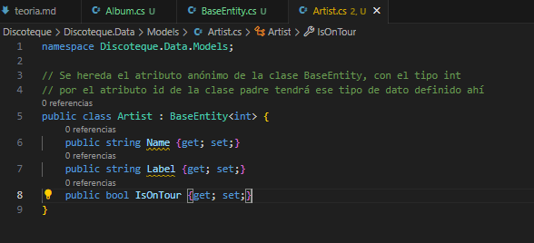

> No crear Primary Keys con strings

3. Y luego la clase Album:

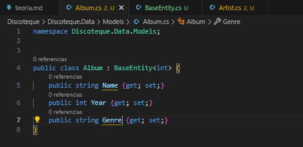

> Una enumeración es un descriptor para un grupo de valores que siempre son constantes

Se agrega una enumeración para los géneros y se cambia el tipo de dato de la variable Genre:

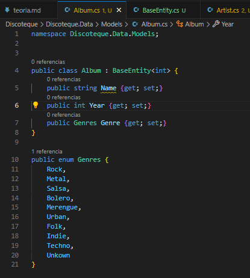

4. Después de haber creado estas clases, ir a la carpeta raiz y correr el comando 

        dotnet build

Al final se observa lo siguiente:

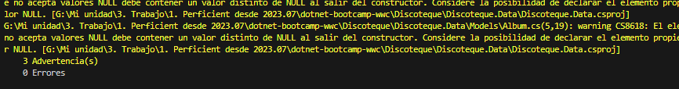

5. Con e objetivo de evitar que salga este warning, lo mismo para el caso de la variable Genre porque no se sabe qué es desde un principio:

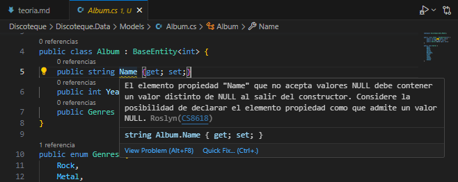

Se debe inicializar como un valor vacío:

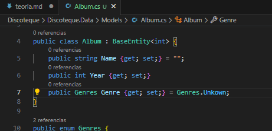

6. Realizar lo mismo en Artist.cs para evitar los warnings que salen al correr el `dotnet build`:

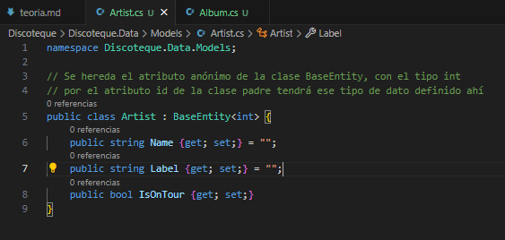

7. Crear el archivo DiscotequeContext.cs en la raíz de Discoteque.Data, en esa clase se debe crear un **constructor** para decir a dónde debe ir a buscar la data

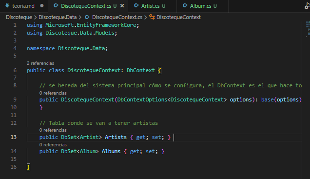

Acá es donde se hace esa definición de las tablas primero

## Cómo utilizar lo que se hizo en Data por parte de la API

1. Se deben importar las librerías en Program.cs en Discoteque.API:

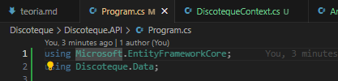

Para que se pueda tomar la referencia de Data y la de Business se debe hacer el siguiente código en la carpeta raíz:
``` shell
dotnet add Discoteque.API/ reference Discoteque.Data/Discoteque.Data.csproj

dotnet add Discoteque.API/ reference Discoteque.Business/Discoteque.Business.csproj
```
Y se hace lo mismo para Business:

        dotnet add Discoteque.Business/ reference Discoteque.Data/Discoteque.Data.csproj

2. El Program.cs está contenido dentro de una clase principal llamada CreateBuilder, en la variable builder se guarda una instancia de una API:

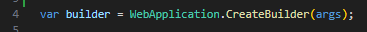


Una **variable var** significa que no se sabe qué tipo es y cuando se asigna obtiene ese tipo de variable, y solo se hace una vez.

Por tanto lo que se hace es definir de qué forma se hará la base de datos en este archivo:

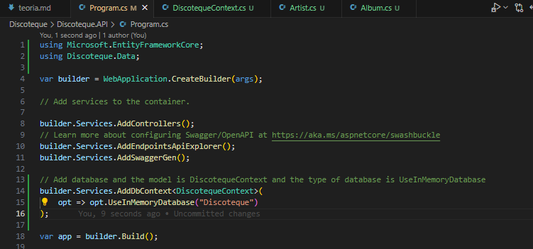

3. Cambiar la ruta a Discoteque.API y ejecutar el siguiente comando:

        dotnet-aspnet-codegenerator controller -name ArtistsController -async -api -outDir Controllers --noViews

Y se obtiene lo siguiente:

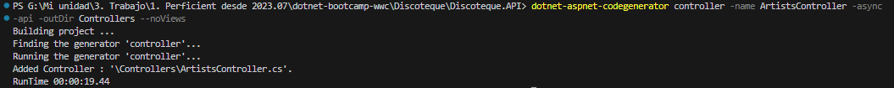

4. Crear las carpetas Services y IServices en la carpeta Discoteque.Business

5. Dentro de IService crear el archivo IArtistService, y dentro de este archivo agregar lo siguiente:

Se creará una **interfaz**: Es un contrato que tiene la definición de los métodos que la clase que hereda está ***obligada*** a implementar

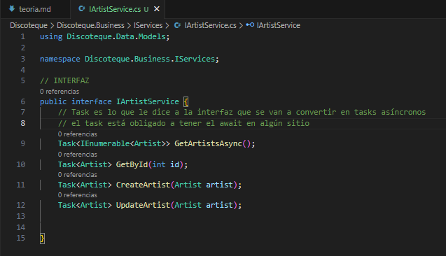

6. Crear a la persona que se va a encargar de esto: En la carpeta Services crear el archivo ArtistService.cs

Para implementar los métodos de la interfaz de forma eficiente pararse en el nombre de la interfaz y hacer el comando `CTRL + .`, donde aparece lo siguiente, y así se da click en la opción de implementar interfaz:

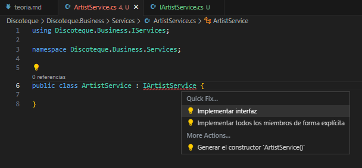

Lo que esto hace es:


7. Agregarle cosas al controlador ArtistsController para que pueda empezar a hacer cosas, pero primero en Program.cs hacer **inyección de dependencias**, es decir que son reutilizables en la mayoría de los controladores

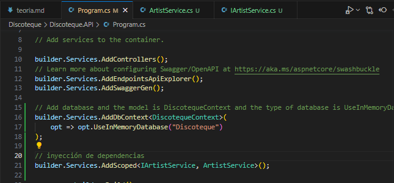

Cuando algo use la interfaz se devuelve una instancia de la clase ArtistService

8. En ArtistController poner lo siguiente:

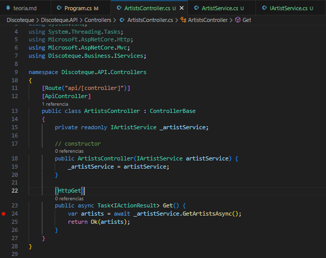


-> Cuando se usa una variable privada en una clase, se nombra con un _ delante del nombre de la variable para usar una copia de lo que venga por fuera dentro de la clase.

9. Luego con este archivo abierto ejecutar el debugger, y poner el link en el postman:

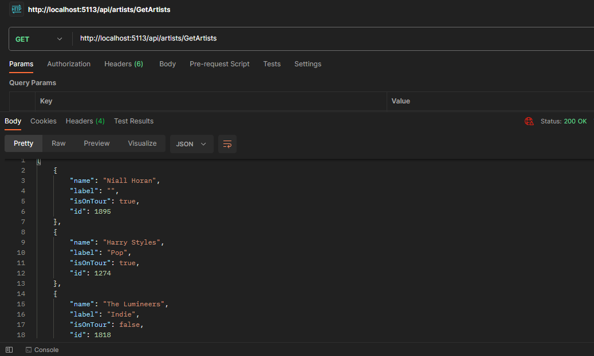

Después de dar siguiente debería lanzar una excepción por la definición de la función que se está llamando en la interfaz.

# Tarea 1:

## Ejercicio 1
Deben implementar en Discoteque.Business.ArtistService el método de GetArtistsAsync()
* Este método debe crear una lista de tipo List\<Artist\>
* Deben crear una entidad de Artist
* Deben agregar esa entidad a la lista y Retornar la lista
* El ID Asignado debe ser al azar utilizando la libreria Random()

***Código implementado:***

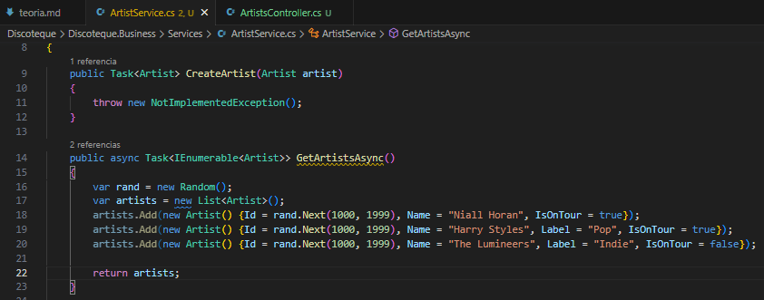

Usar en postman el URL: `http://localhost:5113/api/artists/GetArtists`

***Resultado:***


## Ejercicio #2
Deben implementar Discoteque.Business.ArtistsService el método de CreateArtistAsync()
* Deben recibir un parámetro en la forma de una instancia de Artist
* Deben agregar esa instancia a una lista
* Deben devolver la lista
* El ID asignado debe ser al azar utilizando la libreria Random()

***Código implementado:***

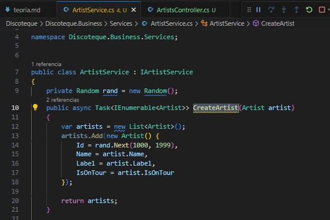

**Resultado:**

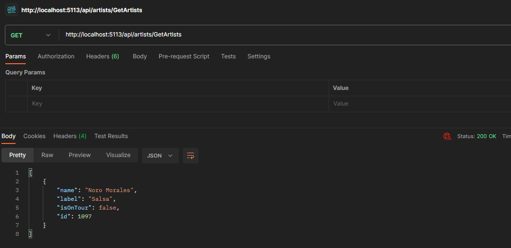

## Ejercicio #3
Deben implementar un endpoint nuevo en Discoteque.API.Controllers.ArtistController para crear un artista
* Deben recibir un JSON con la estructura del artista sin el ID
* Deben invocar el método creado en el ejercicio #2
* Deben retornar el resultado de esa invocación
* el json resultando en POSTMAN debe tener la estructura correcta
* para poder llegar a este Endpoint debe responder a localhost:<puerto>/api/Artists/CreateArtists a través de POST.

***Código implementado:***

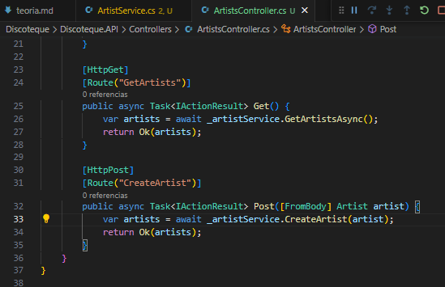

***Resultado:***

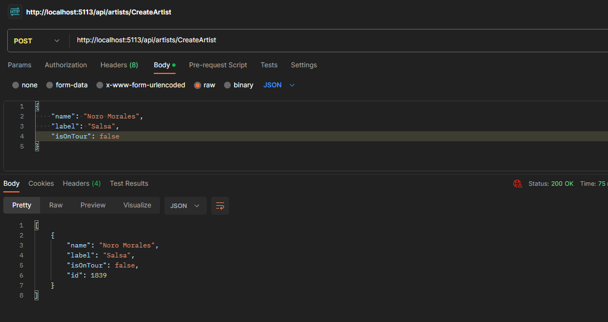

Con este input:

        {
                "name": "Noro Morales",
                "label": "Salsa",
                "isOnTour": false
        }

### Notas relevantes
* El proyecto tiene 3 TODOs en donde deben hacer su implementación
* La URL base del controlador es http://localhost:<puerto>/api/artists/<NombreDelEndpoint>
* Para agregarle un nombre al endpoint uitilizamos [Route("NombreDelEndpoint")]

* Listas
https://learn.microsoft.com/en-us/dotnet/api/system.collections.generic.list-1?view=net-7.0

* Random
https://learn.microsoft.com/en-us/dotnet/api/system.random?view=net-7.0

* Iteración
https://learn.microsoft.com/en-us/dotnet/csharp/language-reference/statements/iteration-statements 


## Pasos finales

Clonar repo

https://github.com/Dracvs/Discoteque

Cambiarse a la rama de dev

        git checkout dev

Y correr el build en esta rama

        dotnet build

# CLASE 3 - 22.07.2023

Ejecutar el comando:

        dotnet watch --project Discoteque.API

Es una forma de hacer debug automático, sin tener que parar y volver a reiniciar.

Con Ctrl+R se actualiza.

## Repositorio genérico

Cuando se hace el `dotnet watch`, el servidor empieza a recibir peticiones http, puerto de depuración: 5044, puerto de SSL: 443.

Cuando se recibe una petición http, el servidor sabe que va al controlador específico y dependiendo de el verbo http realiza una acción. Hay un servicio que sabe donde está la base de datos, el servicio se instancia con el IService que es la interfaz y la inyección de dependencias es la que se encarga en el program.cs de hacer una instancia de esa interfaz para devolver una respuesta (para evitar tener que instanciarlo cada vez que se quiera usar).

La interfaz es la que se referencia y no la clase principal, ya que la interfaz tiene el nombre, tipo y tipo de retorno de lo que se vaya a usar sin importar su implementación. Si se usara la clase normal, se tendría que instanciar por cada clase sin importar que usaran el mismo tipo de estructura.

> Si una clase es la única que tiene acceso a una variable se le pone un guión antes del nombre de la variable, si no se le pone la variable existe solo dentro del alcance de un método o alguien tiene acceso a ella por fuera, lo cual no es lo usual.

## Repositorio

### Discoteque.API

En Program.cs:

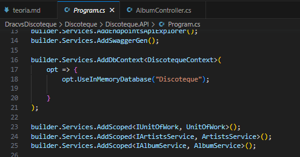

Lo que esto hace es que cuando se llame la interfaz, devuelve la clase original, ahí es donde se está haciendo la instanciación.

Cuando el using se usa dentro del cuerpo de un método quiere decir que lo que esté dentro del paréntesis existe, cuando se salga de esa llave ya no. Se tiene un scope creado arriba porque no se está haciendo inyección donde está el método. Con el using se crea un scope secundario y cuando se cierre se muere

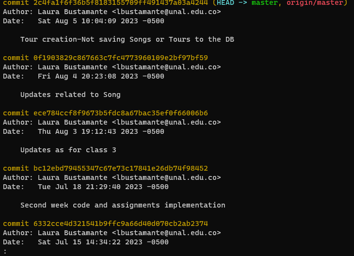

Task es el tipo de retorno de los métodos en las interfaces (pero es una tarea para el procesador)

### IRepository

Es como una plantilla para todas las tablas, se tiene una repositorio que es de tipo T, que significa que se rellene con el tipo que se necesite. 

Los métodos virtuales son métodos que están incompletos, que se pueden modificar en tiempo de ejecución

## ENTENDIENDO EL CÓDIGO

Esta dependencia debía estar instalada en Discoteque.Data:

        dotnet add package Microsoft.AspNetCore.Identity.EntityFrameworkCore --version 7.0.9

# Tarea 2:

## Ejercicio #1
Vamos a crear dos nuevos modelos. Song y  Tour.

song hereda de BaseID y tendrá:

* Nombre
* Duración
* Y a que album está asociado

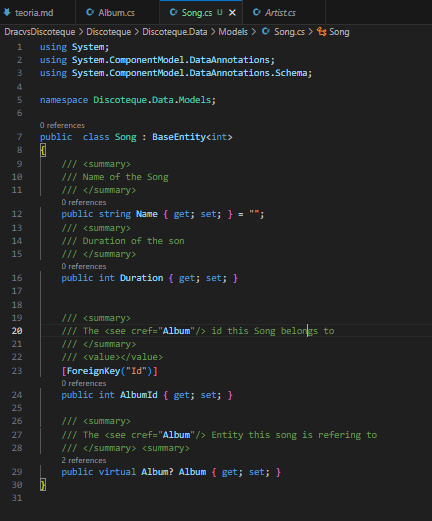

Tour hereda de BaseID y tendrá:

* Nombre del tour
* Ciudad 
* Fecha
* Y si está vendido por completo
* Debe estar asociado a un artista

Estas dos cosas deben tener su controlador, su servicio, y su repositorio genérico.

## Ejercicio #2
Cada Controlador debe poder tener las acciones de 

* agregar,
* editar,
* eliminar,
* y buscar de distintas formas.


## Ejercicio #3
Al agregar de  Canción, y Tour le vamos a agregar captura de excepciones con try catch con los siguientes valores:

✅ Las canciones deben tener un album asociado. Al enviarlo con un album que no existe, capturar la excepción y devolverla.

✅ Los tours deben todos estar en el futuro del 2021.

✅ Al crear un album nuevo, el album debe estar entre 1905 y 2023. Si está fuera de ese rango debe fallar.

✅ Al album le vamos a agregar un costo. En forma de número. El costo no puede ser negativo y puede tener dos decimales. Lo vamos a hacer por defecto en 50.000.

🚩 la fecha la vamos a devolver en ISO 9000. YYYY-MM-DD

✅ Vamos a agregar una acción para agregar canciones en bache o bulto. Que en vez de aceptar una sola, acepte una lista de canciones. Esta lista se pone toda en la cola y luego se guarda. Si alguna falla debe devolverse la excepción y asegurarse que no se guardo ninguna.

✅ Los artistas no pueden tener un nombre superior a los 100 carácteres. 

✅ Los albums no pueden contener en su título la siguiente palabra: Revolución, Poder, Amor y Guerra.

✅ Todas las validaciones se deben hacer en el service (requerimiento)

# CLASE 4 - 29.07.2023
Link for the session: https://www.youtube.com/watch?v=ScRy35nBTNc

## Git repository:
It consists of three main components:
1. **Working directory**: where the changes are made to the files.
2. **Staging area (index)**: it's between the working directory and the repo. Changes made to files are first staged in the index before they are commited. 
3. **Commit history**: Chronological series of snapshots of the project files and folders, each commit represents a specific state of the project.

## Git objects:
Data is organized in some type of objects:
1. **Blob (Binary Large Object)**: Represents file data but doesn't contain any metadata. It stores the content of each file in the repo.
2. **Tree**: Represents a directory and its contents. It contains references to blobs (files) and other subtrees (subdirectories).
3. **Commit**: Points to a specific tree, representing the state of the project at that particular time. It contains metadata such as author info, message and timestamps.
4. **Tag**: A reference to a specific commit, used to label significant points in the project's history.

## Git concepts and commands:
### Concepts:
1. **Fetch**: `git fetch` downloads changes from a remote repo to the local repo, but it doesn't automatically integrates them into the working directory. Instead, it updates the remote-tracking branches, allowing to compare and merge the changes at your convenience.

2. **Push**: `git push` is used to upload the local branch's commits to a remote repo. It allows sharing changes with other team members and make them available.

3. **Pull**: `git pull` is a combination of two commands: `git fetch` followed by `git merge`. It downloads the changes from the remote repo and automatically integrates them into the local branch. If you're in a different branch and want to get all the changes made in the main branch use `git pull origin main`.

> **Git fetch** gets all modifications from all branches but doesn't make any modification over any branch, and **Git pull** tries to combine the changes that it gets from the remote repo.

4. **--force (or -f)**: `--force` is an option used with git commands like: `git push` or `git pull`, to overwrite remote changes and update the remote repo forcefully. This could lead to data loss and disrupt collaboration.

5. **Commit**: `git commit` a commit represents a snapshot of a project's files at a specific point in time. It creates a new version in the commit history, making it easy to track changes and revert to previous states if needed.

6. **Add**: `git add` is used to stage changes from the working directory to the index (staging area). After adding changes, you can commit to record them permanently in the repo.

7. **Amend**: `git commit --amend` is used to modify the last commit. It allows you to combine staged changes with the previous commit or update the commit message.

8. Log: `git log` shows the history of commits made in the repo
        
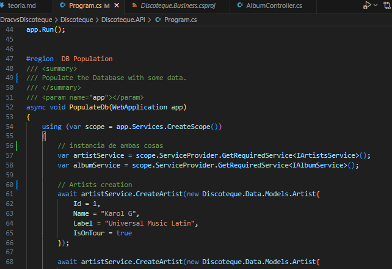

9. Checkout: `git checkout [hash del commit al que se quiere devolver]` it works for when you want to go back in time to a specific commit.

10. Reset: `git reset --hard` it makes the go back in time action, the actual commit, so this is for the checkout to be the most recent commit (to stay in the state in this point of time) and removes what we did in the future. It destroys the commit history to a specific point in time.

11. Switch: `git switch -c "BranchName"` This creates a new branch under a specific name and switchs to it. And to change to a branch that already exists use `git switch [BranchName]`. This branches allow to have a copy of the repo to do and undo things without causing a mess for the other team members.

12. Status: `git status` shows the status of the repo regarding files modified, staged or up to date changes with the remote repo.

13. Diff: `git diff [ModifiedFile]` shows the changes made to a specific file before commiting.

14. Restore: `git restore [ModifiedFile]` this reverts the changes made to a file. In case the file is staged already, use the flag `--staged` before the file name to restore it. This just undos the changes made but doesn't alter the commit history.

> To push a branch that is not in the remote repo, use the command `git push --set-upstream origin [NewBranchName]`

15. Revert: `git revert [hash del commit del que se quieren revertir los cambios]` it creates a countercommit, so you can revert changes from commits and still they will show in the log (history) of commits

# Tarea 3:

✅ crear el basemessage para todas las entidades ***Lo hice pero lo borré para que quedara el genérico***

## Extracredit
✅ convertir el basemessage a basemessage genérico y utilizar uno solo para todos las entidades. Convertir el BuildResponse a una forma genérica totalmente de manera de que sea una clase estática en utils y poderla invocar desde todos los servicios

# CLASE 5 -Testing- 12.08.2023

## Pruebas unitarias: 
Se prueba una sola cosa. En este caso se prueba un solo servicio.
Un archivo de pruebas: Una prueba por cosa, una prueba de algo que falle, y diferentes condiciones.
El controlador llama a una interfaz que es una implementación de un servicio, esos dos llaman a la BD que es UnitOfWork, y el Repositorio. Se tienen muchas clases. Cuando se hace una prueba no se tiene que instanciar todo, se instancia solo el servicio y esas cosas que se necesitan llamar se hacen como un mock, que lo que haría es devolver un resultado que está predeterminado. Porque si se instancia todo, se puede tocar la BD y hacer un daño.

### ¿Por qué hacer pruebas unitarias?
Si se hace algún cambio, correr todas las pruebas unitarias para validar que no se está dañando nada.

## Mock: 
Es un objeto en memoria que no es real que se encarga de devolver lo que se necesita saber. Es una implementación de unaa interfaz falsa.
Ayuda a probar que el servicio funcione.

## TDD: Test Driven Development
Se escribe la prueba primero para que falle y después el código que va a fallar, luego se acomoda el código para que funcione (refactorizarlo), luego se optimiza el código y después se terminan de escribir las pruebas que hacen falta.

> Se escriben con base en los requerimientos de las historias de usuario -> **Esto es una utopía**

Las historias de usuario nunca están completas, lo único completo es qué deben hacer las cosas en rasgos generales, las pruebas se hacen con base en esa idea general, si actulizan la descripción, se mejora la prueba.

### Gerkin
Herramienta para hacer las historias de usuario.

> *Por lo general, se escribe todo el código y después se hacen las pruebas* 

## Patrón AAA (Arrange, Act, Assert)
* **Arrange:** Organizar la prueba, crear todos los mocks que no se van a instanciar pero que se necesitan
* **Act:** Es la prueba, que normalmente es una línea
* **Assert:** Hay un solo assert por prueba, no hay condiciones ni comparaciones dentro de él. Es una clase que se encarga de comprobar cosas y dentro tiene métodos para probar las cosas, se puede poner un método y **una sola condición dentro**. Se pueden poner un if else, cada uno con assert, en ese caso se trataría también de un solo assert, ya que si cumple una sola, se pasa a un solo assert y ya.

## Librerías para testear
* MSTest en Visual Studio
* En Java es JUnit, NUnit, xUnit (también se usan en otros lenguajes, pero estas librerías esperan que se definan los métodos set y get para cada propiedad y es algo tedioso de hacer)
* En JavaScript Jester, Playwright, Cypress, Selene
* En react es VDom, pero se usa Jester

### Librería a usar: NSubstitute

Para la parte de Tests, se debe crear un proyecto aparte, agregarlo a la solución, hacer referencia a Data y a Business e importar las librerías para business, usando los comandos en Discoteque:

        dotnet new classlib -o Discoteque.Tests
        dotnet sln add Discoteque.Tests/      
        dotnet add Discoteque.Tests/ reference Discoteque.Data/Discoteque.Data.csproj
        dotnet add Discoteque.Tests/ reference Discoteque.Business/Discoteque.Business.csproj

        cd .\Discoteque.Tests\

        dotnet add package NSubstitute
        dotnet add package NSubstitute.Analyzers.CSharp
        dotnet add package Microsoft.NET.Test.Sdk
        dotnet add package MSTest.TestAdapter
        dotnet add package MSTest.TestFramework

## Plugins de VS para atacar la deuda técnica de un proyecto tipo SonarCloud
* Sonarlint
* Snyk

C# internamente tiene uno llamado **Roslyn** (refactorizador de C#)

## Para correr los tests realizados:
Ejecutar el comando `dotnet test` en la carpeta raíz del proyecto (Discoteque)

Y muestra lo siguiente:

        PS G:\Mi unidad\3. Trabajo\1. Perficient desde 2023.07\dotnet-bootcamp-wwc\Discoteque> dotnet test
        Determinando los proyectos que se van a restaurar...
        Todos los proyectos están actualizados para la restauración.
        Discoteque.Data -> G:\Mi unidad\3. Trabajo\1. Perficient desde 2023.07\dotnet-bootcamp-wwc\Discoteque\Discoteque.Data
        \bin\Debug\net7.0\Discoteque.Data.dll
        Discoteque.Business -> G:\Mi unidad\3. Trabajo\1. Perficient desde 2023.07\dotnet-bootcamp-wwc\Discoteque\Discoteque.
        Business\bin\Debug\net7.0\Discoteque.Business.dll
        Discoteque.Tests -> G:\Mi unidad\3. Trabajo\1. Perficient desde 2023.07\dotnet-bootcamp-wwc\Discoteque\Discoteque.Tes
        ts\bin\Debug\net7.0\Discoteque.Tests.dll
        Serie de pruebas para G:\Mi unidad\3. Trabajo\1. Perficient desde 2023.07\dotnet-bootcamp-wwc\Discoteque\Discoteque.Tests\bin\Debug\net7.0\Discoteque.  Tests.dll (.NETCoreApp,Version=v7.0)
        Herramienta de línea de comandos de ejecución de pruebas de Microsoft(R), versión 17.6.0 (x64)
        Copyright (c) Microsoft Corporation. Todos los derechos reservados.

        Iniciando la ejecución de pruebas, espere...
        1 archivos de prueba en total coincidieron con el patrón especificado.

        Correctas! - Con error:     0, Superado:     1, Omitido:     0, Total:     1, Duración: 490 ms - Discoteque.Tests.dll (net7.0)

> Con el comando `explorer .`, en la termial de vs en la carpeta del proyecto, se abre el explorador de archivos en esa carpeta.

# Tarea 4:

Completar los casos de prueba para canciones y tour:

en todos los casos:

Escribir una prueba que se encargue de revisar la inserción y una prueba por cada condición
Escribir una prueba que levante una excepción
Escribir una prueba para las busquedas parametrizadas

Sencillo. No hay mucha magia que hacer ahí pero si tienen que utilizar su imaginación. 


# Tarea 5
Abrir una cuenta en supabase utilizando su github y esperar a la clase magistral para configurarla y empezar a utilizarla con Entity Framework y migraciones.
Si quieren ir probando cosas pues, investiguen y lean. Pero eso lo voy a dar en algún sitio. 
Voy a subir al repo de discoteque otro proyecto que sea el front end para que también lo vayan conectando. Lo comparto cuando esté listo.

https://supabase.com/ 


# Connect entity Framework to live Database in Supabase

## Abstract

This instruction manual will outline the steps to create a Entity Framework on a live PostgresDatabase. The steps are equally exchangable to a SQL Server Database.

## Supabase Setup

Supabase is a Postgres online database. It is free on its first tier and can be used to develop small projects and learn how to use it.

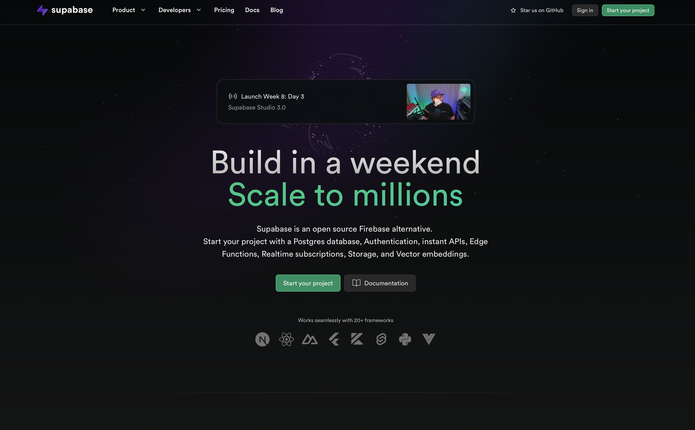

- In this case we need to login into supabase with either the github login or a Single Sign On (be it google or something else)

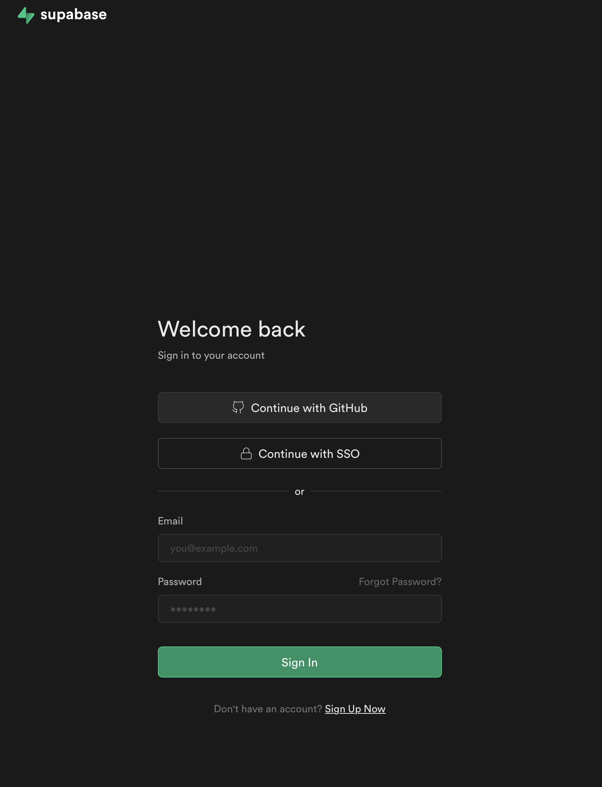

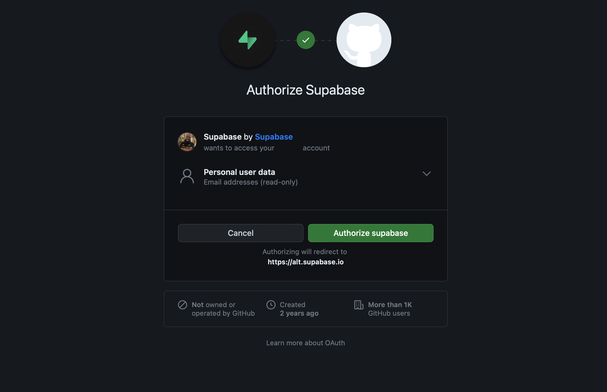

- In the next page we will the main page for the Supabase, in the center there is a Create project button, this is our next stop.

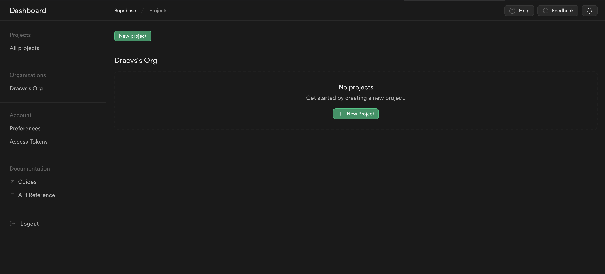

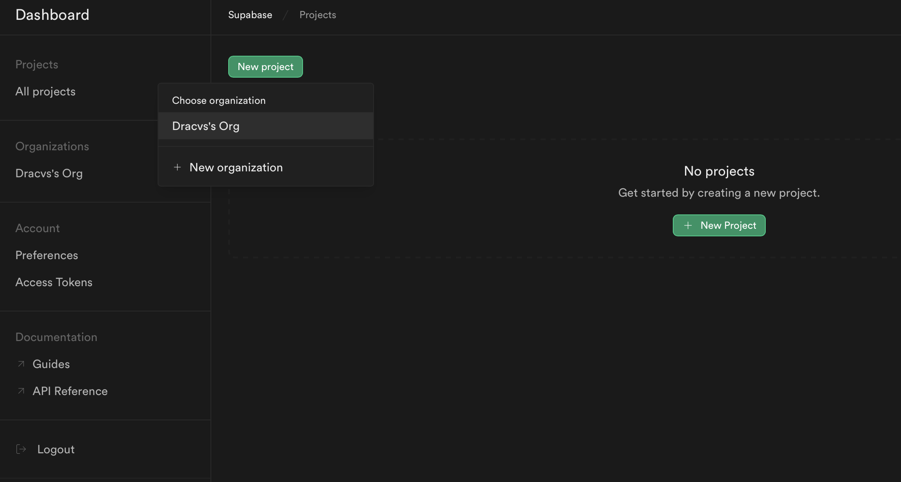

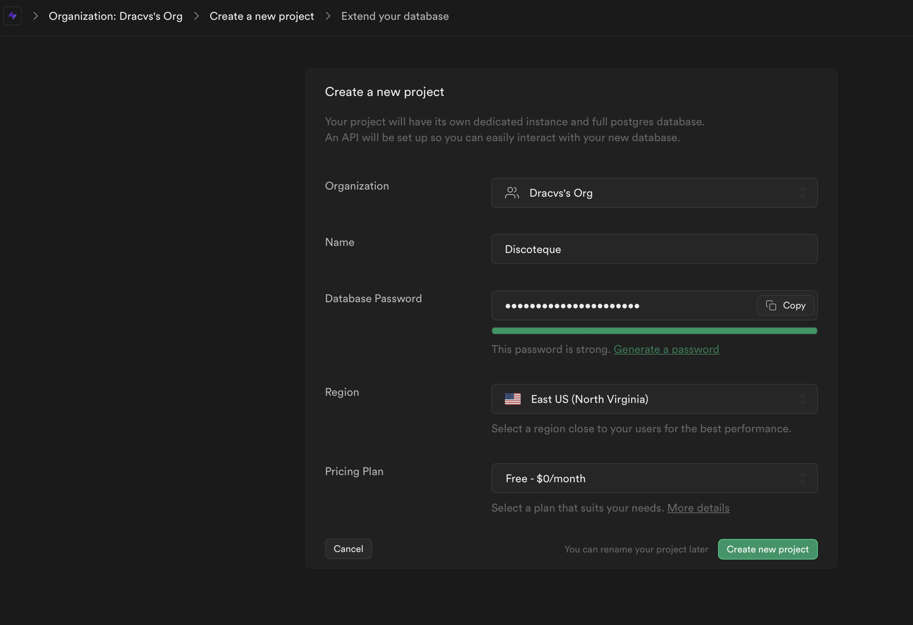

- In this page we will receive the name of the project, the database password and the pricing, we will use Free/0 since our project purpose is entirely academic.

- Once created the new project, we will receive the API keys, (which are the public keys) the service role (which must be kept secret) the URL of the Project and the JWT token Secret.

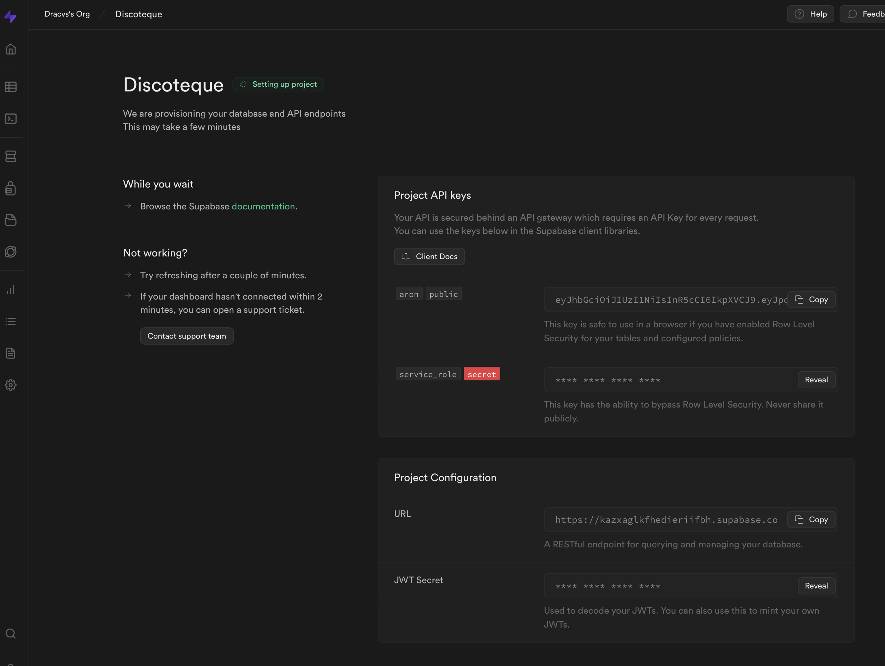

Following the creation will be the screen where we will work.

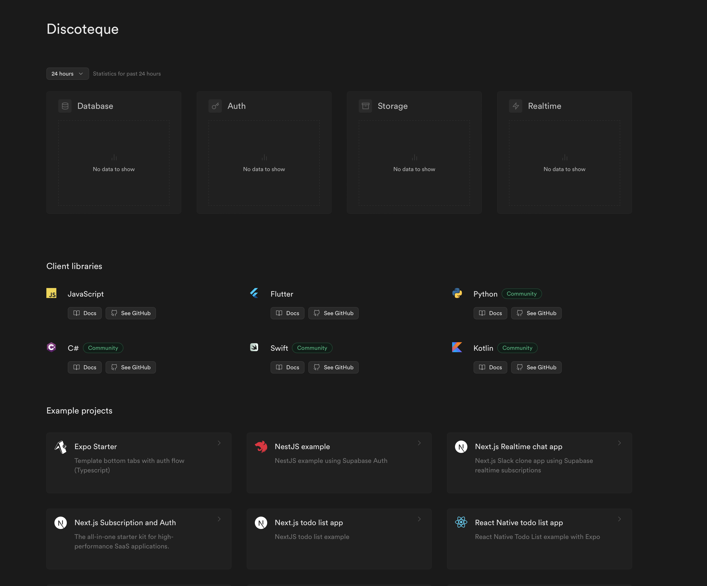

## Setting up the EF Project

- First things first we need to find the PostgreSQL Connection String. SupaBase does have a lot of tooling to make things work. but in this project we will learn how to use our UnitofWork, we can use of course the Supabase Tooling instead of our Linq DbContext as well.

- We need to install the following library so we can actually connect to the PGSQL. in both the Data and the API

```bash
dotnet tool install --global dotnet-ef
cd Discoteque.API/
dotnet add package Npgsql.EntityFrameworkCore.PostgreSQL 
cd Discoteque.Data
dotnet add package Npgsql.EntityFrameworkCore.PostgreSQL 
```

- Then we will add the Connection String to our development Json file `appsettings.Development.json`

```json
{
  "Logging": {
    "LogLevel": {
      "Default": "Information",
      "Microsoft.AspNetCore": "Warning"
    }    
  },
  "ConnectionStrings": {
    "DiscotequeDatabase": "Host=[MYSERVER];Username=[MYUSERNAME];Password=[MYPASSWORD];Database=[MYDATABASE]"
  }
}
```

- Remember that these changes MUST NOT be uploaded to the server so always stash them or make them a server variable.

- In the `program.cs` we do the following change to the data connection

```csharp
builder.Services.AddDbContext<DiscotequeContext>(
    opt => {
        opt.UseNpgsql(builder.Configuration.GetConnectionString("DiscotequeDatabase"));
    }    
);
```

- You need to replace the values with the ones provided by Supabase:
  - Host is the key as an URL.
  - Username is usually postgres
  - the post is usually 5432
  - The database is the one you inputted when you created the database proper.
  - Finally the database is the name you gave to your databse, in this case, mine is called Discoteque.

- We then create the first migration for the Database. This is done in the Command console.
- While being in the API project execute the following.

```bash
dotnet dotnet ef migrations add InitialCreate --project ../Discoteque.Data
```

- Before we do the next part, we need to make sure to be using the development environment, if not it will fail.
- First let check wht your ASPNETCORE_ENvironment variable has

```bash
echo $ASPNETCORE_ENVIRONMENT
```

- If you’re using PowerShell in Windows, `execute $Env:ASPNETCORE_ENVIRONMENT = "Development"`

- If you’re using Mac/Linux, execute `export ASPNETCORE_ENVIRONMENT=Development`

```bash
dotnet ef database update
```

- Once you are done you should have the following in your Supabase DB

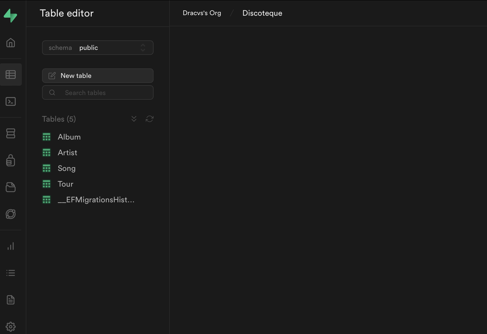

- We will repurpose a single method for populating the database. We can do this as SQL Script or using the populateDB method, first we need to update our DBContect constructor

```csharp
public DiscotequeContext(
        DbContextOptions<DiscotequeContext> options) 
        : base(options)
    {
        AppContext.SetSwitch("Npgsql.EnableLegacyTimestampBehavior", true);
    }
```

- Once done, you need to comment the PopulateDb in the Program.cs
